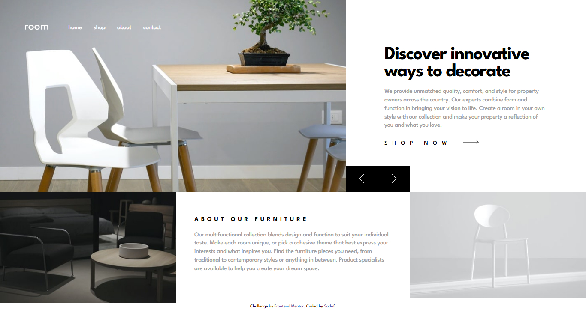
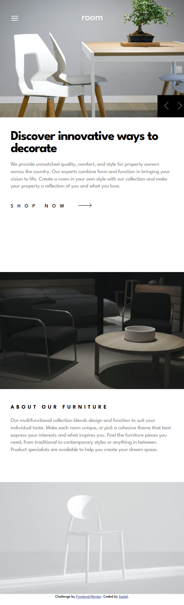
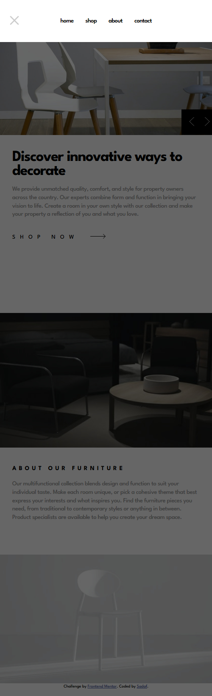

# Frontend Mentor - Room homepage solution

This is a solution to the [Room homepage challenge on Frontend Mentor](https://www.frontendmentor.io/challenges/room-homepage-BtdBY_ENq). Frontend Mentor challenges help you improve your coding skills by building realistic projects. 

### The challenge

Users should be able to:

- View the optimal layout for the site depending on their device's screen size
- See hover states for all interactive elements on the page
- Navigate the slider using either their mouse/trackpad or keyboard

### Screenshot
- Desktop View:

- Mobile View:

- Mobile View-Navbar:

### Links

-  [Live Site URL](https://sadafes.github.io/Room-homepage/)

### Built with

- Semantic HTML5 markup
- CSS custom properties
- Flexbox
- CSS Grid
- Mobile-first workflow
- JS 

### What I learned

I had a lot of challenges with flex and grid.It would have been impossible without using the grid. I tried to pay attention to the details of the design.
